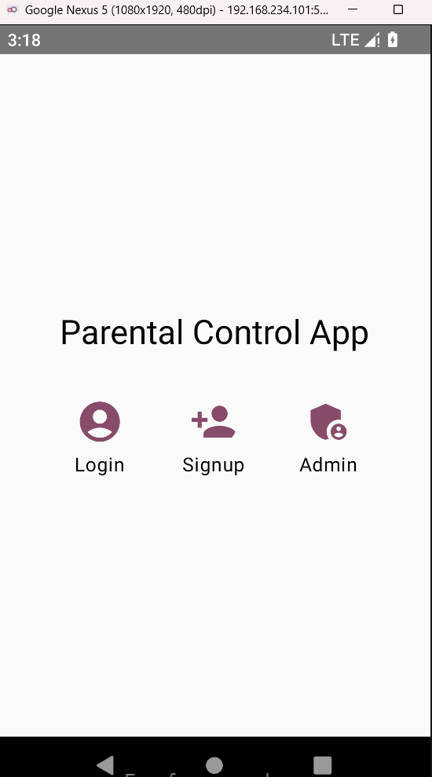
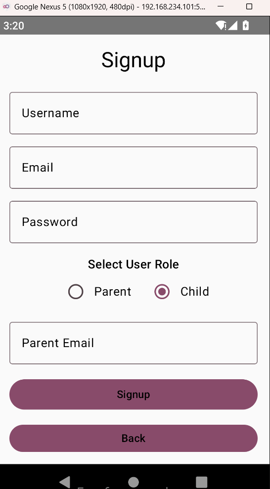
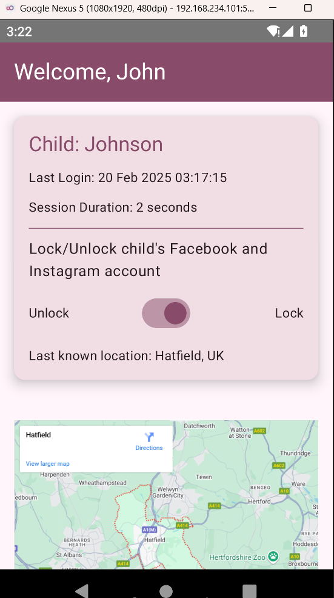
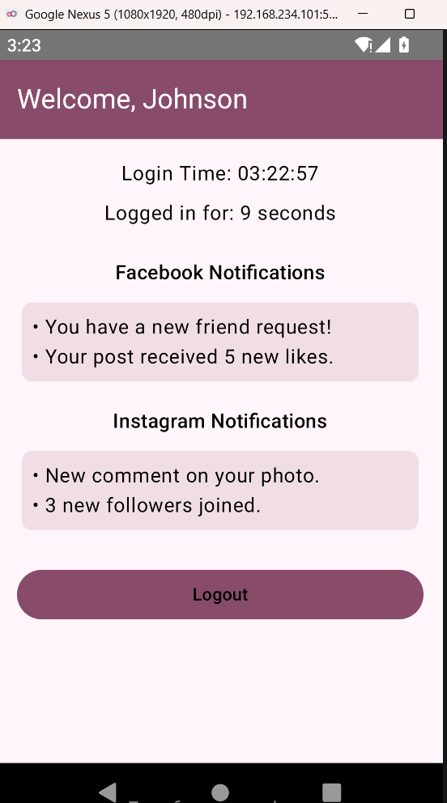

# Parental Control App

A simple Android application built with Jetpack Compose that demonstrates Firebase Authentication with a JSON fallback.

## Features

- **Firebase Authentication:**  
  Sign up and log in using Firebase Authentication (Email/Password).
- **JSON Fallback:**  
  When Firebase is unavailable, the app falls back to a local JSON file for authentication and user data.
- **Role-Based Dashboard:**  
  - **Parent Dashboard** shows the parent’s welcome screen, a static map image for the child’s location, and session details.
  - **Child Dashboard** displays the child’s session time and dummy notifications.
- **Session Tracking:**  
  Logs and tracks child login times and session durations.

## Requirements

- Android Studio (Arctic Fox or later recommended)
- Android device or emulator running Android 5.0 (API level 21) or above
- Kotlin 1.8.0 or later
- Jetpack Compose (latest stable version)
- Firebase Authentication (with a valid Firebase project setup)

## Setup & Installation

1. **Clone the Repository:**
   ```bash
   git clone https://github.com/yourusername/parental-control-app.git
   cd parental-control-app
    ```

2. **Open in Android Studio:** 

Open the project in Android Studio. The project uses Gradle for dependency management.

3. **Configure Firebase:**

-Place your google-services.json file in the app/ directory.
-Enable Email/Password authentication in your Firebase Console.

4. **Build and Run:**

-Connect a device or start an emulator.
-Build and run the app.


## Usage
1. **Launch the App:**
Select Login or Signup from the landing screen.

2. **Signup / Login:**

-Enter your credentials.
-If Firebase fails or is unavailable, the local JSON fallback will handle authentication.

3. **Parent Dashboard:**

-Shows a static map image, child’s last login time, and session duration if available.

4. **Child Dashboard:**

Displays session start time, a running session duration, and dummy notifications (Facebook/Instagram).

5. **Logout:**

Tap the Logout button to return to the main screen.

## Screenshots

### Landing Screen


### Signup (Parent)


### Signup (Child)


### Parent Dashboard


### Child Dashboard



